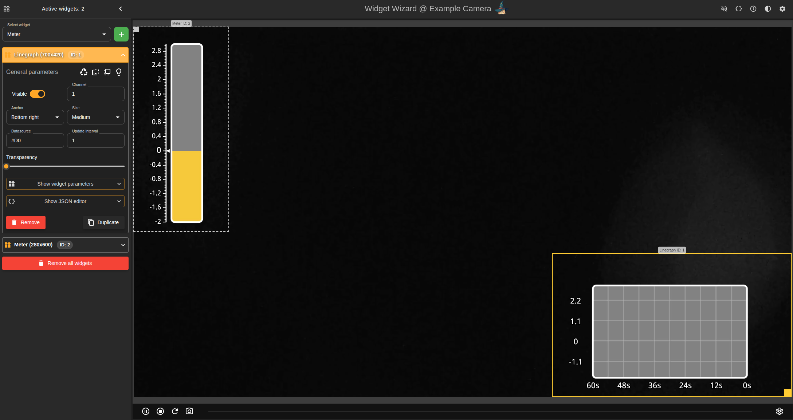

# Widget Wizard 

Application for managing in-stream widgets on Axis devices. \
Written in TypeScript and React.

> **⚠️ IMPORTANT** \
> Requires a device with widgets capabilities available.\
> Unofficial app: Requires "Allow unsigned apps" to be enabled.

## Get the latest pre-built release under Releases

## How to build 🛠️

Make sure you have Docker and Make installed.

Then run:

```shell
make app
```

<br/>

