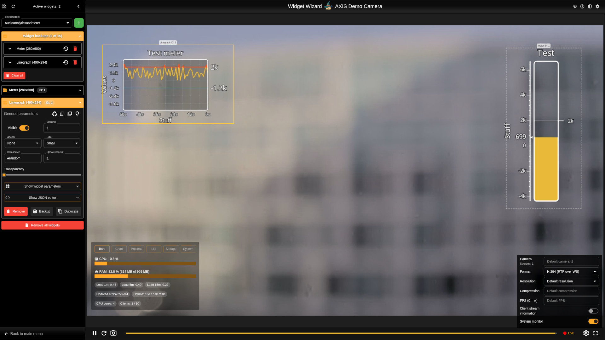

# Widget Wizard 

## What is this?

Web frontend for managing in-stream widgets and overlays on Axis network cameras. \
Written in TypeScript and React.

The UI runs directly on the camera as part of the installed ACAP application (see below).

### Features

* Create and edit in-stream widgets and overlays
* Auto-generated UI controls for different types of widgets
* Fine-tune widgets and overlays with the built-in JSON editor
* Customizable bounding boxes for easy repositioning of widgets and overlays
* Backup and restore widgets and overlays to browser local storage
* Built-in video-player with support for (almost) all resolutions and formats offered by the device
* Responsive and easy to use

> **⚠️ IMPORTANT** \
> Requires a device that supports widgets or overlay capabilities.\
> Unofficial app: Requires "Allow unsigned apps" to be enabled.

## Get the latest pre-built release under [Releases](https://github.com/ErikMN/widget_wizard/releases)

## How to build 🛠️

Make sure you have Docker and Make installed.

Then run:

```shell
make app
```

This produces an installable ACAP `.eap` file for installation on the device.

## Screenshot



## Purpose

Hobby project to learn about modern UI development against a moving target. \
Axis cameras are advanced devices with a lot of features and a built-in
configuration web UI. \
Recreating the full official UI is outside the scope of this project.

This frontend is deployed by using the [ACAP](https://www.axis.com/products/acap)
framework which allows for installing custom applications on an Axis device.
